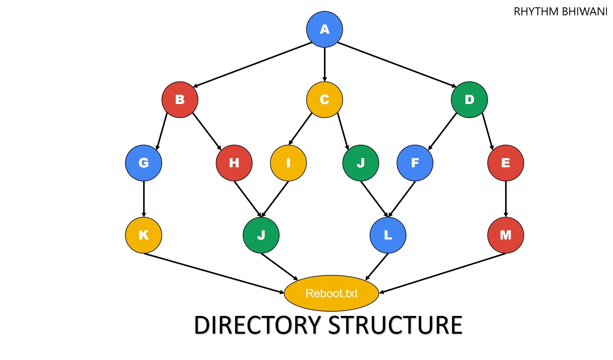

# Assignment 1 - Linux Basic Tasks
## Problem 1 - Block System Call:
* block system call for date command
* that means you don't have to uninstall date command but if you run kernel must not accept
* do the same Firefox as well


## Problem 2 - Play with Directory:
* create a directory without name from command line

```
mkdir ''$'\n'
```
This directory will not be shown in the GUI


* create a directory with name "-okgoogle"

```
mkdir -- "-okgoogle"
```


## Problem 3 - Create a Directory Structure
* You are only allowed to use a single command and only one time



### Solution 3
Run this code in the terminal
```
mkdir -p A/{B/{G/K/REBOOT.TXT,H/J/REBOOT.TXT},C/{I/J/REBOOT.TXT,J/L/REBOOT.TXT},D/{F/L/REBOOT.TXT,E/M/REBOOT.TXT}}
```
After that check by running tree command


## Problem 4 - Share Files and Folder
* create two users name jack and Jill  from command line
* create all the data under home directory of each users
* login with jack user and create a file name  jack.txt using vim editor and write "hello jack"
* from jack user also create two directories name jack1 & jack2
* now login from Jill user and create a file. Jill.txt using vim editor and write "hey jill"
* from Jill also create two directories named jill1 & jill2
> swap these files and directories in between users  and to swap don't use root account.

## Problem 5 - Play with files and directories
* create  4 files named   abc.txt  ok  fine  g.txt  /tmp directory
```
touch /tmp/{abc.txt,ok,fine,g.txt}
```
* create  3  directories   aa aaa aaaa  under  /tmp directory
```
mkdir /tmp/{aa,aaa,aaaa}
```
* give ls command to  list the content of  /tmp directory


* make sure it will only list the content (file|directory)  having 2 char in their name.
```
ls /tmp/ | grep -E '^(..)$'
```


## Problem 6 - Run command without any output
* open terminal and type any command
* once you press enter your output of given command must not  print
* you are not allowed to redirect output anywhere
